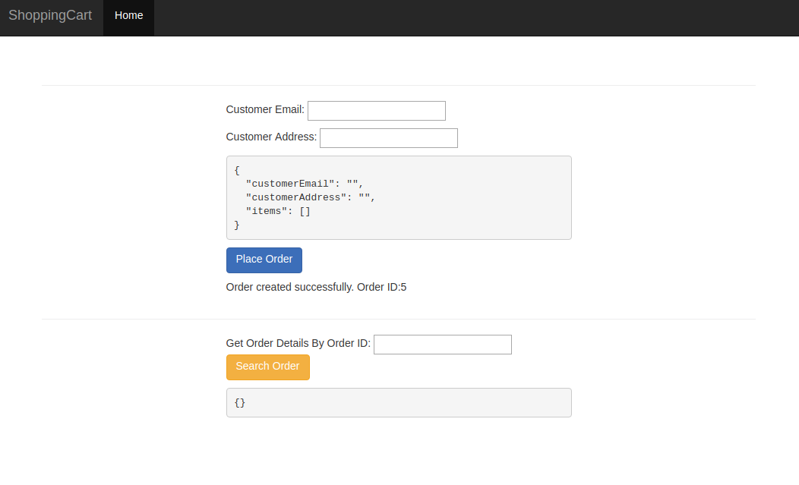

# spring-boot-microservices-series
Code for SpringBoot MicroServices Blog Series

## How to run?

### Build all modules:

`spring-boot-microservices-series> ./mvnw clean package -DskipTests=true`

### Start infrastructure modules in docker:

`spring-boot-microservices-series> docker-compose up -d mysqldb rabbitmq setup-vault zipkin-server config-server service-registry hystrix-dashboard`

* To know docker host IP: docker-machine env
  * sample output:
    * export DOCKER_TLS_VERIFY="1"
    * export DOCKER_HOST="tcp://192.168.99.100:2376"
    * export DOCKER_CERT_PATH="C:\Users\Glenn\.docker\machine\machines\default"
    * export DOCKER_MACHINE_NAME="default"
    * export COMPOSE_CONVERT_WINDOWS_PATHS="true"
    * Run this command to configure your shell:
    * eval $("D:\Docker Toolbox\docker-machine.exe" env)

* MySQL container:
     * hostname: mysqldb
     * Ports : 3306:3306 (<host_port>:<container_port>)
     * Username/Password: root/admin

* RabbitMQ:
     * hostname: rabbitmq
     * Ports: 5672:5672, 15672:15672
     * Admin UI: http://localhost:15672
        * or Docker sample: http://192.168.99.100:15672/#/
     * Username/password: guest/guest

* Vault:
    * hostname: vault
    * Ports: 8200:8200
    * Admin UI: http://localhost:8200
    * Root token: 934f9eae-31ff-a8ef-e1ca-4bea9e07aa09

* Zipkin:
    * hostname: zipkin
    * Ports: 9411:9411
    * Admin UI: http://localhost:9411/zipkin/

* config-server:
    * hostname: config-server
    * Ports: 8888:8888
    * URL: http://localhost:8888/

* service-registry:
    * hostname: service-registry
    * Ports: 8761:8761
    * Eureka UI: http://localhost:8761/
    
* hystrix-dashboard:
    * hostname: hystrix-dashboard
    * Ports: 8788:8788
    * Dashboard UI: http://localhost:8788/hystrix

**Start each microservice either in local or in docker:**

**Local:** `spring-boot-microservices-series/catalog-service> ./mvnw spring-boot:run`
OR: > java -jar -Dserver.port=9797 target/catalog-service-0.0.1-SNAPSHOT-exec.jar
(Now if you go to http://localhost:8761 you will notice that 2 instances of catalog-service got registered and you can see their hostname: port details as well.)

**Docker:** `spring-boot-microservices-series> docker-compose up -d --build --force-recreate <service> `

Ex: `spring-boot-microservices-series> docker-compose up -d --build --force-recreate catalog-service`

(URLs specified are not UI!)

* catalog-service:
    * hostname: catalog-service
    * Ports: 18181:8181
    * URL: http://localhost:18181
    
* inventory-service   
    * hostname: inventory-service
    * Ports: 18282:8282
    * URL: http://localhost:18282
    
* order-service  
    * hostname: order-service
    * Ports: 18383:8383
    * URL: http://localhost:18383 
    
* shoppingcart-ui    
    * hostname: shoppingcart-ui
    * Ports: 18080:8080
    * URL: http://localhost:18080
    * UI: http://localhost:8080/ui/
   

